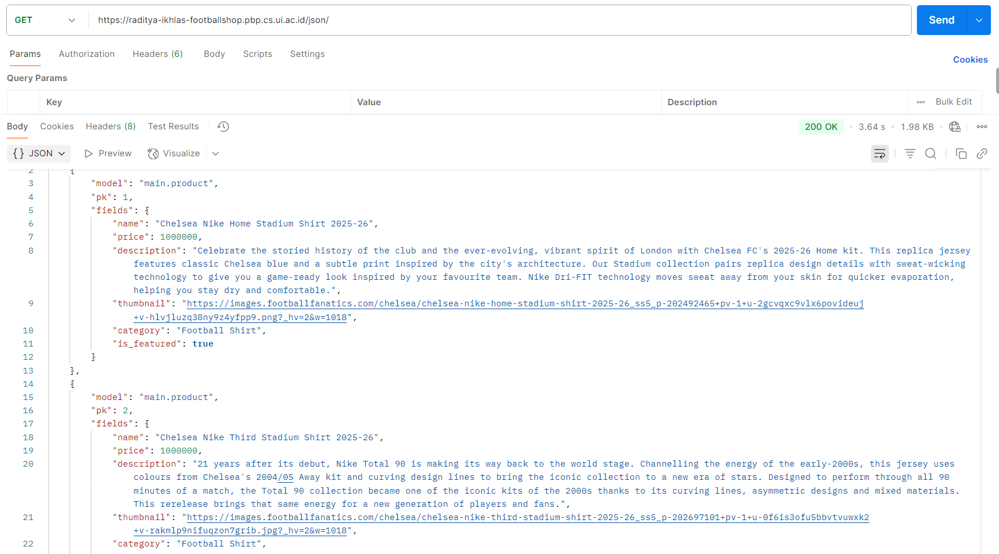
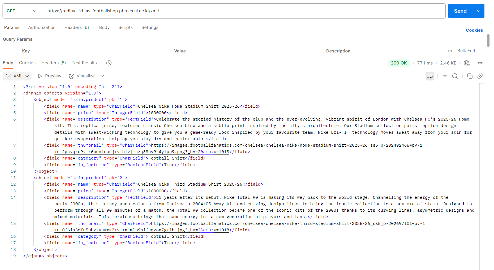
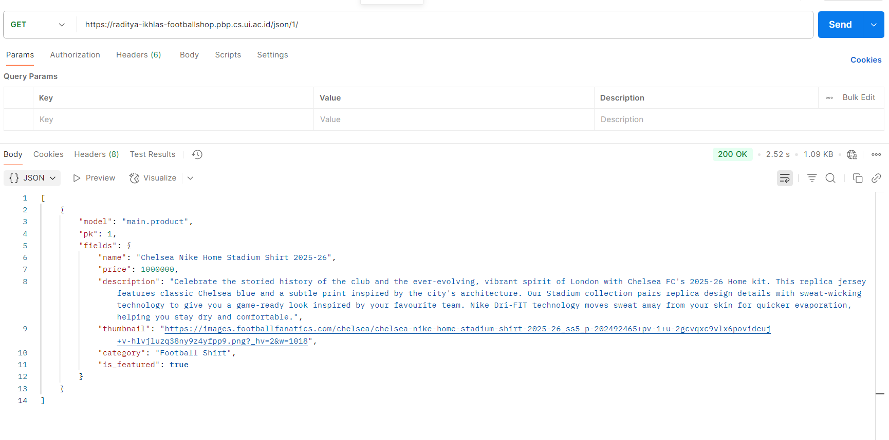
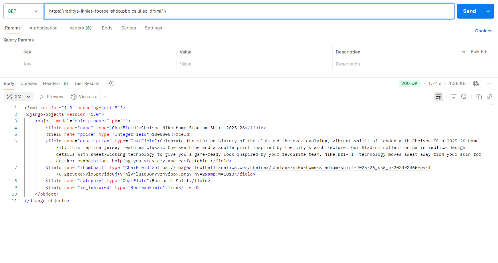

1.	Answer the following questions in the README.md file in the root folder.
-	Why do we need data delivery in implementing a platform?
In today’s web development landscape, a single platform often needs to serve many different clients such as desktop browsers, mobile apps, and even third-party services. To support this flexibility, it’s crucial to separate the data layer from the presentation layer. By doing so, the same data can be provided to multiple front-ends without being tied to one specific interface. Exposing the application’s data in machine-readable formats like JSON or XML makes this possible.

-	 In your opinion, which is better, XML or JSON? Why is JSON more popular than XML?
XML supports complex document schemas but is complicated. JSON is lighter, faster to parse, and maps directly to Python objects and JavaScript, which explains its dominance in modern web APIs. For Football Shop, JSON is the natural default.

-	What is the purpose of the is_valid() method in Django forms, and why do we need it?
The is_valid() method ensures that all user input passes validation before it is stored in the database. When called, it runs every field validator and returns True only if the data is clean and correct. It also provides a cleaned_data dictionary containing safely processed values. In Football Shop, this mechanism guarantees that information such as product name, price, and image URL is accurate and secure, preventing invalid or unsafe data from being saved.

-	Why do we need a csrf_token when making forms in Django? What can happen if we don't include a csrf_token in a Django form? How can this be exploited by an attacker?
Every POST form in Football Shop includes a  to protect against Cross-Site Request Forgery (CSRF) attacks. A CSRF attack occurs when a malicious site tricks a logged in user into submitting an unwanted request such as creating or editing a product using the user’s credentials. Django checks the token on each submission to ensure that the action really comes from the Football Shop site. Without this protection, an attacker could forge requests and compromise the integrity of the application.
-	Explain how you implemented the checklist above step-by-step (not just following the tutorial).
a Product model was defined with six required fields such as name, price, description, thumbnail, category, and is_featured to represent the key attributes of each item. A ProductForm model form was added to simplify input and validation. Views were implemented to list all products (show_main), add a new product (add_product), and show product details (show_detail). Four data-delivery views show_json, show_xml, show_json_by_id, and show_xml_by_id use Django’s serializers to output data in JSON or XML. All views were connected through urls.py, templates were created to match the Football Shop theme, and the app was deployed to PWS with the proper ALLOWED_HOSTS and CSRF_TRUSTED_ORIGINS settings. 
-	Do you have any feedback for the teaching assistants for Tutorial 2?
Tutorial 2 was clear and the teaching assistant is very helpful
2.	Access the four URLs in point 2 using Postman, take screenshots of the URL access results in Postman, and add them to your README.md.

